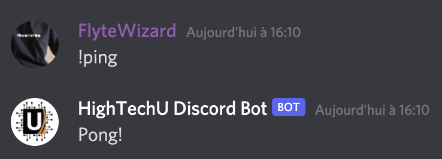

## About

The purpose of our discord bot is to assist students and teenagers with independent studying. No need to worry about extensive instructions and commands. Our near-linear user flow will allow for a simple and refreshing experience. Our screen use limiting feature is all-new and innovative, featuring one of the best known fables of Aesop, "The Crow and the Pitcher".

For more information about the commands visit the "[documentation](https://hightechu.github.io/accelerator-studytime-bot/docs)".

## Screenshots

## Technologies

The HighTechU Discord Bot uses the following technologies: Discord.js, Node.js, Firebase, Heroku, Bootstrap, and GitHub Pages.

## License

The project uses the [MIT LICENSE](https://choosealicense.com/licenses/mit/).

## Authors

- Elaine
- Juppnaam
- Steven
- Bernice
